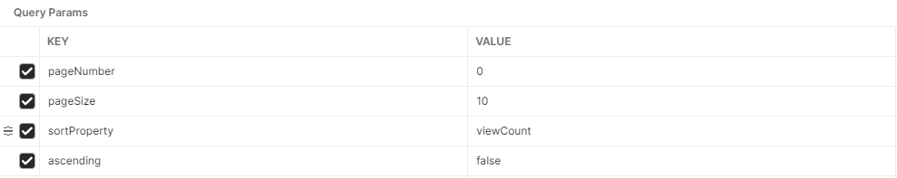

# Social Networking Posts API
The following project is simple implementation of CRUD API for social networking posts. It contains basic operations:
* get all posts by entering endpoint http://localhost:8099/api/v1/posts with mandatory Query Params for Pagination:
  * Integer pageNumber
  * Integer pageSize
  * String sortProperty
  * Boolean ascending

Sample query params for get top ten post with the highest view count 
* get post by id by entering endpoint http://localhost:8099/api/v1/posts/{id}
* create single post by entering endpoint POST http://localhost:8090/api/v1/posts with sample request body:
 ```json
{
    "content": "2",
    "author":"Michal"
}
```
* update post by entering endpoint http://localhost:8099/api/v1/posts/{id} with sample request body:
```json
{
    "id": 2,
    "content": "Post",
    "author": "Michal",
    "viewCount": 2,
    "postDate": "2022-04-13"
}
```
* delete posts by entering endpoint http://localhost:8099/api/v1/posts/{id}

# Getting Started
In this project is implemented simple database migration through liquibase library.
To run just pick Profile Dev or Prod by setting proper VM options:
* Dev: `-Dspring.profiles.active=dev`
* Prod: `-Dspring.profiles.active=prod`


### Reference Documentation
For further reference, please consider the following sections:
* [Official Apache Maven documentation](https://maven.apache.org/guides/index.html)
* [H2 database](https://www.h2database.com/html/main.html)
* [Spring Data JPA](https://docs.spring.io/spring-boot/docs/3.0.5/reference/htmlsingle/#data.sql.jpa-and-spring-data)
* [Spring Web](https://docs.spring.io/spring-boot/docs/3.0.5/reference/htmlsingle/#web)
* [Liquibase Migration](https://docs.spring.io/spring-boot/docs/3.0.5/reference/htmlsingle/#howto.data-initialization.migration-tool.liquibase)
* [Validation](https://docs.spring.io/spring-boot/docs/3.0.5/reference/htmlsingle/#io.validation)
* [Dozer](https://javadoc.io/doc/net.sf.dozer/dozer/latest/index.html)


### Guides
The following guides illustrate how to use some features concretely:

* [Accessing Data with JPA](https://spring.io/guides/gs/accessing-data-jpa/)
* [Building a RESTful Web Service](https://spring.io/guides/gs/rest-service/)
* [Serving Web Content with Spring MVC](https://spring.io/guides/gs/serving-web-content/)
* [Building REST services with Spring](https://spring.io/guides/tutorials/rest/)
* [Validation](https://spring.io/guides/gs/validating-form-input/)
* [Dozer mapping](https://www.baeldung.com/dozer)

