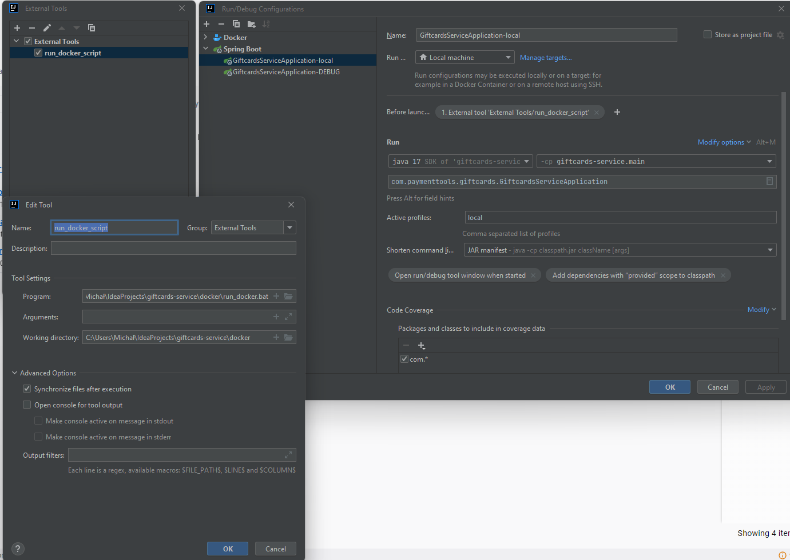

# giftcards-service

## How to run application
+ Giftcard service is strictly dependent on `loyalty service` and `spanner database`. So, please make sure that these containers are 
   up and running before starting `giftcards-service`.   

+ To start every needed above components we can run script `run_docker` which will redirect user to provide credentials of GCP account (if needed) and later 
   will pull the latest docker image of `loyalty service`. At the end it will run all needed components by running `docker-compose up` command. `run_docker`
   script is  located in `docker` directory. There are two ways to run it: from `Windows` - `.bat` and from `Linux` - `.sh`. Additionally, you can choose 
  from which environment you want to run it: `DEV` or `INT`. By default, it will run `DEV` environment. To run `INT` environment you have to remember also 
  about image tag because there is not `latest` tag yet. So the correct command to run `INT` environment is for example: 
```
./run_docker.sh INT main-423523423
```
**REMEMBER** Firstly you have to install `gcloud CLI` and run `docker engine`.

+ To totally automate process of start our application you can add this script before launching spring boot app. To do that in `Run/Debug Configuration` in 
   IntelliJ you have to choose `Before launch` option through shortcut `Alt+M` (at the bottom) and add `External tool` with `run_docker` script path. To 
   maximize performance I suggest disable checkbox `open console for tool output`. The best solution to work it out of the box is to change terminal from 
  POWERSHELL to CMD. To do that you have to go to `Settings` -> `Tools` -> `Terminal` and change `Shell path` to `cmd.exe`.
+ Good to remember is also to have only one database file in gcloud configuration. To check this we have to go to `C:\Users\Michał\AppData\Roaming\gcloud` 
  and change name of `credentials.db` to `credentials.db.old` and leave `access_tokens` as it is



## Setup connection to local spanner

JDBC URL:

 ```
 jdbc:cloudspanner://localhost:9010/projects/giftcards-project/instances/giftcards-instance/databases/giftcards-database?autoConfigEmulator=true
 ```